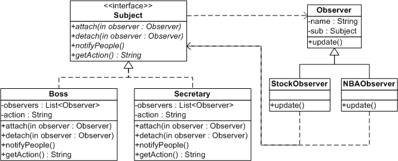
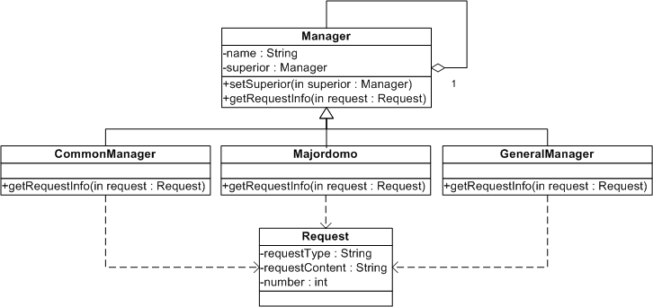
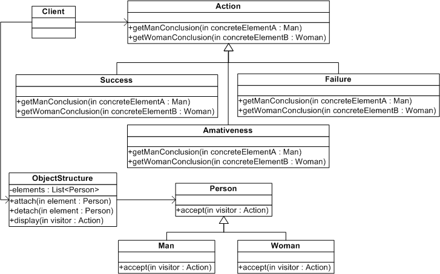

## Design Pattern

此项目主要介绍在编程中常用到的 21 种设计模式，根据包名来区分不同的设计模式，首先要提醒一点的是，设计模式只是在语义上有所区分，但在语法上，很多设计模式区别不大，比如都要提取父类接口，会有似曾相识的地方；换句话说，不要纠结于设计模式的名字，遇到具体问题的时候，不要拘泥于条条框框，应该自然而然的该怎么设计就怎么设计，至于用的什么设计模式？无所谓的。

此项目中大部分的设计模式都有相应的示例代码，放于该设计模式的 Demo 包下面，每个 Demo 都很简单，适合于初学者（补充：很多 Demo 都用继承来写，但继承其实是一种耦合度很高的方式，要谨慎使用，能用接口最好用接口实现）。**一定记住，先学脉络，再学细节**，这是学习规律，看别人代码很容易陷入细节中，导致思维混乱，其实看不懂没关系，卡住了就先跳过，先学会怎么用，再去学为什么，学开车总不是先学汽车原理吧。

有人说，设计模式就是把简单的问题复杂化，没有错，确实如此，但是它复杂得有理有据，就看你将来想在哪个方向上进行扩展，那它就在那个方向上产生多态、就在那个方向上产生抽象、就在那个方向上复杂化。站在使用者的角度开发，**没有思路的时候记住了，一旦需要灵活制定某些实现的时候，或者需要在将来可能会以不确定的方式来扩展系统的时候，抽象和多态是永远少不了的**。**可扩展性（Extensibility）是面向对象的核心，也是其精华所在，不然你感受不到系统之间精妙的结构那种乐趣**。

另外一点，在设计上面，**既不能不敢设计，也不能过度设计，更没有对错之分，最重要的是不停地动手写**。每个阶段做出一点成果，会更容易坚持下去。在工作层面上来讲，首要任务应该是先把功能实现，重构是在有余力或者有需要的情况下进行的。

**不要追求完美**。

### 目录

[**1.单例模式**](#10)  
[2.简单工厂模式](#20)  
[3.工厂方法模式](#30)  
[4.抽象工厂模式](#40)  
&emsp;[4.1 抽象工厂标准写法](#41)  
&emsp;[4.2 用简单工厂来改进抽象工厂](#42)  
&emsp;[**4.3 用反射+抽象工厂+配置文件实现**](#43)  
[**5. 装饰模式**](#50)   
[**6. 建造者模式**](#60)  
[7. 适配器模式](#70)  
[8. 备忘录模式](#80)  
[**9. 模板方法模式**](#90)  
[10. 原型模式](#100)  
[**11. 代理模式**](#110)  
[**12. 中介者模式**](#120)   
[**13. 策略模式**](#130)  
[**14. 状态模式**](#140)  
[**15. 命令模式**](#150)  
[**16. 享元模式**](#160)   
[17. 组合模式](#170)  
[**18. 桥接模式**](#180)   
[**19. 观察者模式**](#190)   
[**20. 责任链模式**](#200)  
[21. 访问者模式](#210)   
 
[001. 迪米特法则](#001)  
[002. 依赖倒转原则](#002)  
[003. 合成/聚合复用原则](#003)

### 1. 单例模式

主要介绍了单例模式的饿汉式和懒汉式两种形式。

适用场景：  
保证类只有一个实例。

举例说明：  
1.电脑中的任务管理器，不管打开多少次，始终只有一个。  
2.Hibernate中 的 SessionFactory，MyBatis 中的 SqlSessionFactory。  
3.获取数据库驱动时的 DriverManager.getDriver(...)。  
4.Spring 中的 Bean，默认就是单例级别的。

&nbsp;

### 2. 简单工厂模式

所谓工厂，在现实中指的是生产自己产品的地方，在 Java 中也是一样，工厂类用来控制产生对象的逻辑，而不再依赖于 new 的方式，因为用 new 的方式来产生对象太容易了，任何地方都可以 new，如果我们想要控制产生对象的数量或者增加一些判断条件，就比较麻烦。

适用场景：  
工厂类中包含了必要的逻辑判断，可以根据客户端的选择条件动态地实例化相关的类，对于客户端来说，去除了与具体产品的依赖。

Demo：  
编写简单的计算器程序，要求输入两个数，得结果（加、减、乘、除）。  

&nbsp;

缺点：  
如果以后计算器程序增加了计算平方的功能，那么就需要去修改简单工厂类，为其增加  
 case 的分支条件。**修改原有的类，违反了开放-封闭原则。**

&nbsp;

### 3. 工厂方法模式

优点：  
定义一个工厂类接口，使得能让一个类的实例化延迟到工厂类接口的子类中。这样做不会  
违背开放-封闭原则。可能应用到的场景有：  
a、日志记录器：记录可能记录到本地硬盘、系统事件、远程服务器等，用户可以选择记录  
日志到什么地方。   
b、数据库访问：当用户不知道最后系统采用哪一类数据库，以及数据库可能有变化时。   
c、设计一个连接服务器的框架，需要三个协议，"POP3"、"IMAP"、"HTTP"，可以把这三  
个作为产品类，共同实现一个接口。

Demo：  
用工厂方法模式来改进用简单工厂写的计算机程序。  

&nbsp;

缺点：  
每加一个新产品，就需要加一个产品工厂的子类，增加了额外的开发量。而且，工厂方法  
模式把简单工厂的内部逻辑判断转移到了客户端来进行，客户端需要决定实例化哪一个子  
类工厂来实现运算类，**选择判断的问题依然存在。**

&nbsp;

### 4. 抽象工厂模式

此模式在 JDK 和许多开源框架（比如 Spring）中随处可见，它们很容易被发现：任何用于创建对象但返回接口或抽象类的，就是抽象工厂模式了。它也可以与策略模式结合使用。

#### 4.1 抽象工厂标准写法

优点：  
易于交换某一产品系列。

举例说明：  
一键更换主题皮肤。

Demo1：  
某一网站是基于 SqlServer 数据库运行的，现在要将其改为基于 Oracle 数据库运行。最终的目的是能够修改一处就能灵活转换系统所使用的数据库，Demo1 以对 User 表和 Department 表的操作举例说明。  

&nbsp;

缺点：  

a、一个系统访问数据库表的客户端不可能只有一个，因此如果整个系统要更换使用的数据库的话，那么就要将所有客户端（Client）中的:（例如）    IFactory factory = new OracleFactory();  
改为:    IFactory factory = new SqlServerFactory();  
这**不能实现改动一处就更改全部**的要求，这是抽象工厂 Demo1 的缺点之一。

b、如果以后客户端要访问一张新表，例如要新增部门表（Department），那么除了要增加 「IDepartmentOperation、OracleDepartOper、SqlServerDepartOper」 这三个新的类以外，还要修改原有的 「IFactory、OracleFactory、SqlServerFactory」 这三个工厂类才可以完全实现，这样**大批量地改动原有类**的做法是不好的，是 Demo1 的另一个缺点。

#### 4.2 用简单工厂来改进抽象工厂

用 DataAccess 类取代之前的 IFactory、OracleFactory、SqlServerFactory 三个工厂类，并在 DataAccess 类中预设数据库，客户端只需调用，不用传参。  

采用这样的结构之后，一旦增加新的数据库或是对新表的操作，只需要修改 DataAccess 类即可，相比 Demo1 而言修改的类变少了，比 Demo1 的结构要好一些，但是同时也带来了简单工厂模式的缺点。

Demo2：  
用简单工厂来改进 Demo1。  

&nbsp;

#### 4.3 用反射+抽象工厂+配置文件实现

优点：  
反射**用字符串来实例化对象**，而字符串在变量中是可以更换的。因此用反射可以去除 switch 或者 if 判断语句，从而解除分支判断带来的耦合。可以说所有用到简单工厂的地方，都可以考虑用反射代替。

Demo3：  
用反射+抽象工厂+配置文件技术改进 Demo2。（其实改进的类只有 DataAccess 类）

小结：工厂模式包含了 3 种，在实际应用时，选用标准为**降低耦合度的目的是否达到**。

&nbsp;

### 5. 装饰模式

适用场景：  
动态地给一个对象添加一些额外的职责，就增加功能来说，装饰模式比生成子类更灵活，应用较广。比如 AOP，既用到了动态代理，但同时也有一些装饰者的味道。

当系统需要新功能的时候，我们有可能向旧类中加入新的字段、方法或者逻辑，这样的做法增加了旧类的复杂性，而往往这些新加入的东西仅仅是为了满足一些只在某种特定情况下才会执行的需求。装饰模式就对这种情况提供了一个很好的解决方案，它把每个要新增的功能放在单独的类中，并让这个类包装它所要装饰的对象，因此，当需要执行特殊行为时，客户代码就可以在运行时根据需要有选择地、按顺序地使用装饰功能包装对象了。

Demo：  
给一个人动态搭配不同的服装（Avatar系统）。

&nbsp;

&nbsp;

### 6. 建造者模式

也叫生成器模式。

适用场景：  
将一个复杂对象的构建与它的表示分离，使得同样的构建过程可以创建不同的表示。使用建造者模式后，用户只需要指定需要建造的类型就可以得到它们，而具体建造的过程和细节就不需知道了。  

它主要是用于创建一些复杂的对象，这些对象内部的建造顺序通常是稳定的。比如订单系统中的订单对象，非常复杂但是创建流程相对固定，因此可以使用建造者模式来做。

Demo：  
用程序画两个特征不一样的小人。

&nbsp;

说明：  
如果没有使用建造者模式，那么我们在画小人的时候就可能是先画一个瘦的小人，再画一个胖的小  
人，在画第二个胖的小人的时候可能因为我们的疏忽而忘记画某一个部位，导致建造出来的对象是  
不对的。所以当建造的步骤逐渐增多的时候，这种出错遗漏的概率就越大。

&nbsp;

### 7. 适配器模式

适配器包括类适配器和对象适配器，但由于类适配器要用到多重继承，所以此处只讲对象适配器。

适用场景：  
希望复用一些现存的类，但是接口与复用环境要求不一致的情况。比如需要复用一些早期代码的功能。因此适配器模式通常是在双方接口都不太容易修改时，在软件开发后期或维护期才考虑使用。模式虽好，但不能滥用哦。简单来说，凡是输入接口和输出接口不一样的，就可以认为是一个适配器，这跟现实中的电源适配器是一个意思，输入电压 220V，输出电压 110V。

实际应用：  
1、JDBC-ODBC Bridge，虽然有单词 bridge，但其实是 Adapter 模式，一边是微软访问数据库的方式 ODBC，一边是 Java 的接口 JDBC，JDBC 不能直接访问 ODBC，因此 JDBC-ODBC Bridge 就作为 Adapter 的角色适配彼此。  
2、java.io 包，比如 InputStreamReader，一边是 Stream 接口，一边是 Reader 接口，InputStreamReader 在中间做适配。

Demo：
姚明刚开始去 NBA 打球时听不懂英语，做一个翻译适配器。

&nbsp;

&nbsp;
  

### 8. 备忘录模式  

适用场景：  
适用于功能比较复杂的，但需要维护或记录属性历史的类。

Demo：  
记录游戏角色状态，保存游戏进度。Demo1 是不好的做法，写出来为了提醒自己不犯同样的错误，  
推荐 Demo2 的做法。

&nbsp;

优点：  
使用备忘录可以把复杂对象的内部信息对其他的对象屏蔽起来。当角色状态改变的时候，有可能这  
个状态无效，这时候就可以使用暂存的备忘录将状态复原。

缺点：  
以 Demo2 为例，角色状态需要完整存储到备忘录对象中，如果状态数据很大很多，那么在资源的  
消耗上，备忘录对象会非常耗内存。

&nbsp;

### 9. 模板方法模式

适用场景：  
当不变的和可变的行为在方法的子类实现中混合在一起时。这个模式很常用。

优点：  
模板方法模式将不变的行为搬移到了超类，去除了子类中的重复代码。

Demo：  
先抄试卷，然后作答。

&nbsp;

&nbsp;

### 10. 原型模式

适用场景：  
一般在初始化的信息不发生变化的情况下，用克隆是最好的办法。这样不仅隐藏了对象创建的细节，而且由于不用重新初始化对象，而是动态地获得对象运行时的状态，性能也大大提高。在我们的业务代码中，经常要使用到的各种 DTO、BO、DO、VO 间的转换，就可以参考原型模式的思想来做。

Demo：  
简历复印，并有可能修改其中的某份简历。Demo1 为浅复制，Demo2 为深复制。

&nbsp;

&nbsp;

### 11. 代理模式

概念：  
为其他对象提供一种代理用来控制对此对象的访问，可理解为代理就是真实对象的代表，应用很广。分为静态代理（编译期，代理类是程序员写好的）和动态代理（运行期，代理类是动态生成的）。

适用场景：  
1.远程代理。也就是为一个对象在不同的地址空间提供局部代表，这样可以隐藏一个对象存在于不同地址空间的事实。例如：在创建 WebService 客户端的时候，我们会引用一个 WebService 地址，然后生成客户端一些相关的文件，其实这些就是代理，使得我们可以通过调用代理就解决了远程访问的问题。

2.虚拟代理。根据需要创建开销很大的对象，然后通过它来存放实例化需要很长时间的真实对象，这样的做法可以提高性能。例如：当我们打开一个很大的 HTML 网页时，文字能很快看到，但是图片需要一张一张下载后才能看到。那些未打开的图片框，就是通过虚拟代理替代了真实的图片，此时代理存储了真实图片的路径和尺寸。

3.安全代理。用来控制访问真实对象时的权限。

4.智能指引。是指当调用真实的对象时，代理去处理另外一些事。比如当对象没有引用时，代理去自动释放它；或是在访问一个实际对象前，代理去检查它是否已经被锁定等等。它们都可以通过代理去处理一些附加的操作。

Demo：  
追求者害羞，于是请一个代理人代其向美女送礼物。  

&nbsp;

&nbsp;

### 12. 中介者模式

适用场景：  
对象间多对多的复杂交互。此模式将网状结构转换成星型拓扑结构，很好地应用了迪米特法则。实际应用包括我们熟知的 Java Swing 的事件机制，它就是以 JFrame 窗体作为中介来操作各个具体控件间的交互。还有 MQ，也是中介者模式的应用。

Demo：  
由联合国安理会处理美国、伊拉克等国家间的问题。

&nbsp;

缺点：  
由于控制集中化，中介者类的职责将越来越多，交互的复杂性变成了中介者的复杂性。因此集中控  
制既是中介者模式的优点，也是它的缺点，使用时要考虑清楚。

&nbsp;

### 13. 策略模式

适用场景：  
需要在不同时间或场景下应用不同的业务规则。这些规则可以理解为一个个算法，策略模式就是用来封装算法的，并让算法间可以互相替换，且替换时不会影响到使用算法的客户端。

在 JDK 中，比较器 Comparator 接口就用到了这个模式（常与 Comparable 接口配合使用，首先让类实现 Comparable 接口来表明自己是可比较的（这样能让排序方法通用），但具体根据什么方式/什么策略来比较大小，则引用 Comparator 接口，让它的子类来实现）；此模式也可用于优化大量的 if...else。

Demo：  
开发一款商场收银软件，包括正常情况下的收银和有促销活动下的收银。

&nbsp;

注意：  
此例用了简单工厂，但没有用到反射，所以依然存在增加分支时需要修改 switch 代码的问题。

&nbsp;

### 14. 状态模式

适用场景：  
当一个对象的行为取决于它的状态，并且它可能在运行时根据状态改变它的行为时。这个模式非常常用，因为一个系统不可能没有状态，比如常见的订单状态、付款状态等等，都能用上。

Demo：  
展现一个员工在不同时间的不同工作状态的变化。比如：上午精神好，中午想睡觉，下午渐恢复，加班苦煎熬。

&nbsp;

&nbsp;
  
### 15. 命令模式

适用场景：  
需要把请求操作的对象和知道怎么执行操作的对象分割开时，或者想实现撤销（unDo / Ctrl+Z）这个功能的时候，往往会用到 Command 模式。所以一般在 Command 接口中，不仅会有 execute 方法用来执行，更重要的是要有 unDo 方法用来撤销，实现的时候需要一个专门的 List 来记录已经执行过的 commands，再结合栈来完成（最后完成的操作先撤销）。比如图形化界面上的撤销、Activiti 工作流。

优点：  
1. 较容易地设计一个命令队列；  
3. 接收请求方可以决定是否接受请求；  
4. 容易实现对请求的撤销和重做；  
5. 容易添加新的具体命令。

Demo：  
烧烤店点烧烤。（和烧烤摊对比来看，烧烤摊就一个人，因此接受请求，执行操作等等一系列都由一个人完成，耦合太紧，客人太多时就容易出错。）

&nbsp;

&nbsp;
  

### 16. 享元模式

适用场景：  
如果一个应用程序使用了大量的对象，而大量的这些对象造成了很大的存储开销时就可以考虑使用。还有就是对象的大多数状态可以写为外部状态，如果删除对象的外部状态，可以用相对较少的共享对象取代很多组对象，此时也可以考虑使用享元模式。

举例说明：  
1. 常用的 String 数据类型；  
2. 围棋、五子棋等游戏中的棋子对象。
3. 只要用到了缓存，基本都是在用享元模式。

Demo：  
不同的商家都要购买网站，但网站的功能是类似的。应用了享元模式之后就不用给每一个客户都单  
独开发一个网站了，共享一个网站的代码即可。

&nbsp;

缺点：  
使用享元模式需要维护一个记录了系统已有的所有享元的列表，而这本身需要耗费资源。另外为了  
使对象可以共享，需要将一些状态外部化，这使得程序的逻辑更加复杂。因此，只有在有足够多的  
对象实例可供共享时才值得使用享元模式。

&nbsp;

### 17. 组合模式  

适用场景：  
需求中体现了部分与整体的层次结构，以及希望用户可以忽略组合对象与单个对象的不同，统一地使用组合结构中的所有对象。

举例说明：  
1.卖电脑时既可以卖单独配件也可以卖组装整机。  
2.复制文件时既可以一个一个复制粘贴也可以对整个文件夹进行复制。  
3.文本编辑时既可以给单个字加粗变色，也可以给整段文字做同样操作。  
4.此模式常用于递归操作的优化上，比如级联操作等等。

两种方式：（透明方式更好）  
1.透明方式。在此 Demo 中，尽管像 HRDepartment 和 FinanceDepartment 这样的 Leaf 类不需要实现 add() 和 remove() 方法，但是在 Company 父类中依然还是声明了，这样做的好处是让它们具备了完全一致的行为接口，便于使用。问题则是会多很多没有意义的实现。

2.安全方式。Company 父类中不声明 add() 和 remove() 方法。客户端调用时需要做相应判断。

Demo：  
为一家在全国许多城市都有分销机构的大公司做办公管理系统，总部有人力资源、财务等部门，分公司及分公司下面的办事处同样需要这样一套办公系统，且同样有人力资源、财务等部门，成树状结构。

&nbsp;

&nbsp;

### 18. 桥接模式 

适用场景：  
对于一个抽象父类，在子类的扩展上可能有两个或者两个以上维度的分类，此时如果想解耦合，并解决它们之间排列组合的问题，就可以用桥接模式。此模式是合成/聚合复用原则的很好应用，继承是一种强耦合的结构，在继承结构无法解决问题的时候，则优先考虑使用聚合。

Demo：  
给不同的手机品牌同时新增一个手机软件。  
这个例子中的手机软件就至少包含两个维度，一是指具体的手机软件，比如 QQ、日历、时钟等等，二是可以指某个手机品牌下的软件，比如小米手机的软件、苹果手机的软件、三星手机的软件等等，两者都可以从手机软件类继承下来，但是一旦产生重合，比如我想要苹果手机的日历软件，或者三星手机的时钟软件，那继续用继承就会导致类的数量无限增长下去，之后每在一个维度上增加一个新的子类，由排列组合产生的新类就会翻番。

正常但是不好的思路：

&nbsp;

正确的思路：

&nbsp;

&nbsp;

### 19. 观察者模式

又叫发布-订阅模式。

适用场景：  
当一个对象的改变需要同时改变其他对象，而且它不知道具体有多少对象有待改变时，就可以用这个模式。一般用到 ZooKeeper 的地方，都会使用这个模式，比如分布式锁、服务发现等。

好处：  
解除耦合。让耦合的双方都依赖于抽象，而不是依赖于具体。从而使得各自的变化都不会影响另一边的变化。 

Demo1:  
公司员工有时想要干自己的事情，但又怕老板发现，于是他们请前台小姐姐帮忙留意，老板来的时候提醒他们一下。

Demo2：  
将观察者模式应用于 Demo1，新增观察者抽象类和通知者抽象类。

&nbsp;

Demo3：  
在这先举一个应用观察者模式的例子。当我们在开发工具 eclipse 中写完一段程序，用 Debug as  
运行时，eclipse 的界面会发生变化：控制台窗体弹出，工具栏也出现很多关于调试的按钮......这  
一个小小的点击动作就引发了这么多的变化，涉及到很多不同的控件。

问题在于这些控件可能不是出自同一制造商，而且它们都是被封装好的，不同制造商的方法名是绝  
对不同的，因此也就不可能让每个控件都去实现同一个观察者接口，抽象观察者失去作用。为了解  
决这一问题，Demo3 采用了**事件委托机制**来实现。

委托是一种引用方法的类型。一旦为委托分配了方法，委托将与该方法具有完全相同的行为。委托  
方法的使用可以像其他任何方法一样，具有参数和返回值。委托可以看作是对函数的抽象，是函数  
的“类”，委托的实例将代表一个具体的函数。

一个委托可以搭载多个方法，使用时所有方法将被依次唤起。关键是这些搭载的方法并不需要属于  
同一个类。

委托也是有前提的，就是委托对象所搭载的所有方法必须具有相同的原形和形式，也就是拥有相同  
的参数列表和返回值类型。

&nbsp;
  
### 20. 责任链模式 

请求在多个处理器中传递，让多个处理器处理同一个请求，旨在解耦发送者和接收者。

适用场景：  
1.请求数据进入具体业务之前，对请求做一系列前置处理。  
这一系列的前置处理各有自己负责的逻辑，被封装为一个个处理器类，并且可以灵活增减处理器的数量，连接这些处理器后就像链子一样，每个请求按照处理链的顺序依次进行处理，直到请求传递完或者请求被拒绝。比如在文本数据入库前，要先删掉文本中的特殊符号、替换掉敏感词；或者在服务端处理用户请求之前，对请求数据先做一些过滤、校验的工作；又或者在将响应返回给客户端之前，对响应数据先做一些包装、修饰的工作等等。  
在 Java 的一些框架中，**凡是带有 Filter 关键词**，**或者用到拦截器的地方**基本都是用这个模式，并且往往是在同一个过滤器中既处理请求 Request，又处理响应 Response，只是数据被过滤器链条处理的顺序正好相反，比如：  
a、Java Web 中的 Servlet；  
Servlet 是服务器端程序，是用于衔接前后端的一种技术，也是 JavaEE 平台下的技术标准，其主要功能通常是通过 HTTP 接收和响应来自 Web 客户端的请求。狭义的 Servlet 是指一个接口，广义的 Servlet 是指任何实现了这个 Servlet 接口的类，一般理解为后者。那 Tomcat 扮演什么角色呢？其实 Servlet 也是 Tomcat 的一个组件，因为 Servlet 的功能需要依赖一个 servlet-api.jar，而这个包是由 Tomcat 提供的，Tomcat 在运行时，会读取 web.xml 文件，然后初始化 ServletConfig、ServletContext 等对象，此时，Servlet 才具备相关的功能。  
b、Struts2 中的 Interceptor。

2.把用户的请求传递，直到可以解决这个请求为止。  
注意：使用时要考虑全面，否则一个请求极有可能到了链的末端都得不到处理，或者因为没有正确配置而得不到处理。

Demo：  
员工申请请假或加薪，谁来批准？

&nbsp;

&nbsp;
此 Demo 的关键点：  
1.一定要给每个管理者设置上司，也就是设置继任者（最高级别除外）。  
2.每个管理者在处理请求时，必须做出判断，是自己处理还是交给继任者处理。

&nbsp;
 
### 21. 访问者模式 

适用场景：  
此模式的目的是要把处理从数据结构中分离出来。因此当数据结构相对稳定，而算法又易于变化时，  
用此模式较好。所以它的优点是增加新的操作很容易，缺点是增加新的数据结构很困难。

GOF 中有人说过，「大多时候你并不需要访问者模式，但是一旦你需要访问者模式的时候，那就是  
真的需要它了」。

Demo：  
打印下面这几句话：  
男人成功时，背后多半有一个伟大的女人。  
女人成功时，背后多半有一个不成功的男人。  
男人失败时，闷头喝酒，谁也不用劝。  
女人失败时，眼泪汪汪，谁也劝不了。  
男人恋爱时，凡是不懂也要装懂。  
女人恋爱时，遇事懂也装作不懂。  

提示：  
「男人」和「女人」，「成功」和「失败」，这都是稳定的数据结构；后面的状态就是多变的算法。

&nbsp;

&nbsp;
&nbsp;

### 001. 迪米特法则

概念：  
如果两个类不必彼此直接通信，那么这两个类就不应当发生直接的相互作用。当其中一个类需要调  
用另一个类的某个方法时，可通过第三者转发这个调用。

通俗解释：  
新员工刚入职时，想认识老员工不需要自己一个一个地去问，找人事部或人事部负责人作为中间者  
介绍即可；电脑或技术问题，也只需要认识技术部负责人后再找到对应的人即可。对于新员工来说，  
有直接作用的只有负责人，且目的都能达到，还比自己挨个去问的效率更高。

好处：  
在类的结构设计上，尽量降低类成员的访问权限，可以降低类之间的耦合度。

&nbsp;

### 002. 依赖倒转原则

概念：  
针对接口编程，不要对实现编程。

好处：  
此原则跟里氏代换原则是分不开的，针对接口编程以后，子类就可以相互替换，而且不会影响到使  
用父类类型的模块。

&nbsp;

### 003. 合成/聚合复用原则

概念：  
一个类里面拥有另外一个类的引用，就是一个聚合。  
其实这在平常开发中非常常用，只是我们不知道它还有这样一个名字，自然而然就用了，这也告诉我们不要老去咬文嚼字，不要纠结字眼，该怎么设计就怎么设计就好了。继承是一种强耦合的结构，父类一变，子类就跟着变，当我们感觉用类继承的方式比较麻烦的时候，那就尽量用聚合来代替。

好处：  
优先使用对象的合成或聚合将有助于保持每个类被封装，并被集中在单个任务上。这样的类和类继承层次会保持较小规模，并且不太可能增长为不可控制的庞然大物。