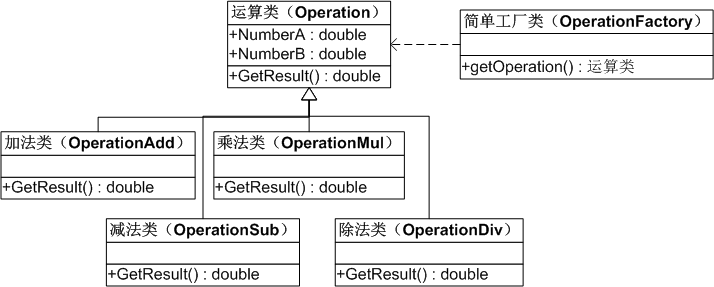
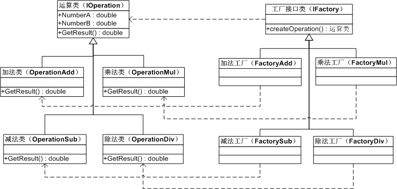
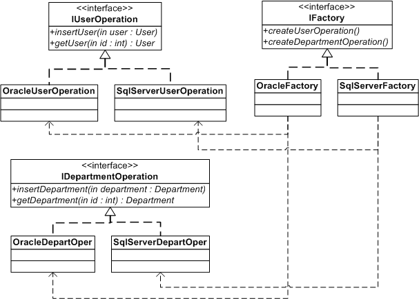
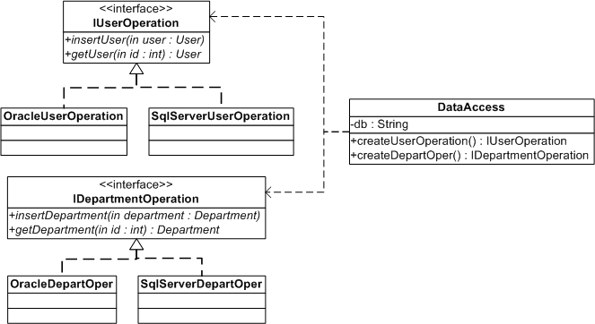
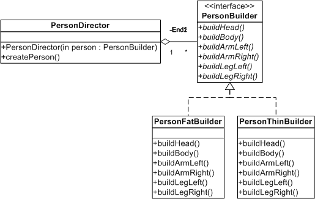
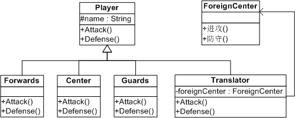
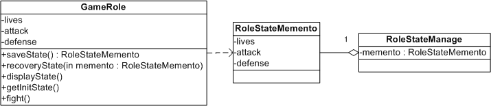

## Design Pattern

此项目用于学习在编程中常用到的 23 种设计模式，根据包名来区分不同的设计模式，大  
部分的设计模式都有相应的实例代码，放于该设计模式的 Demo 包下面，每个Demo 都很  
简单且容易理解，适合于想学习设计模式的初学者。

### 目录

[1.单例模式](#10)  
[2.简单工厂模式](#20)  
[3.工厂方法模式](#30)  
[4.抽象工厂模式](#40)  
[4.1 抽象工厂标准写法](#41)  
[4.2 用简单工厂来改进抽象工厂](#42)  
[4.3 用反射+抽象工厂+配置文件实现](#43)  
[5. 装饰模式](#50)   
[6. 建造者模式](#60)  
[7. 适配器模式](#70)  
[8. 备忘录模式](#80)  
[001. 迪米特法则](#001)

### 1. 单例模式

主要介绍了单例模式的饿汉式和懒汉式两种形式。
  
适用场景：  
保证类只有一个实例。
  
举例说明：  
1.电脑中的任务管理器，不管打开多少次，始终只有一个。  
2.Hibernate中 的 SessionFactory，MyBatis 中的 SqlSessionFactory。  
3.获取数据库驱动时的 DriverManager.getDriver(...)。

### 2. 简单工厂模式

适用场景：  
工厂类中包含了必要的逻辑判断，可以根据客户端的选择条件动态地实例化相关的类，对  
于客户端来说，去除了与具体产品的依赖。

Demo：  
编写简单的计算器程序，要求输入两个数，得结果（加、减、乘、除）。  

缺点：  
如果以后计算器程序增加了计算平方的功能，那么就需要去修改简单工厂类，为其增加  
 case 的分支条件。**修改原有的类，违反了开放-封闭原则。**

### 3. 工厂方法模式

优点：  
定义一个工厂类接口，使得能让一个类的实例化延迟到工厂类接口的子类中。这样做不会  
违背开放-封闭原则。可能应用到的场景有：  
a、日志记录器：记录可能记录到本地硬盘、系统事件、远程服务器等，用户可以选择记录  
日志到什么地方。   
b、数据库访问：当用户不知道最后系统采用哪一类数据库，以及数据库可能有变化时。   
c、设计一个连接服务器的框架，需要三个协议，"POP3"、"IMAP"、"HTTP"，可以把这三  
个作为产品类，共同实现一个接口。

Demo：  
用工厂方法模式来改进用简单工厂写的计算机程序。  

缺点：  
每加一个新产品，就需要加一个产品工厂的子类，增加了额外的开发量。而且，工厂方法  
模式把简单工厂的内部逻辑判断转移到了客户端来进行，客户端需要决定实例化哪一个子  
类工厂来实现运算类，**选择判断的问题依然存在。**

### 4. 抽象工厂模式

#### 4.1 抽象工厂标准写法

优点：  
易于交换某一产品系列。  

Demo1：  
某一网站是基于 SqlServer 数据库运行的，现在要将其改为基于 Oracle 数据库运行。  
最终的目的是能够修改一处就能灵活转换系统所使用的数据库，Demo1 以对 User 表和   
Department 表的操作举例说明。  

缺点：  
  
a、一个系统访问数据库表的客户端不可能只有一个，因此如果整个系统要更换使用的数据  
库的话，那么就要将所有客户端（Client）中的:（例如）  
    IFactory factory = new OracleFactory();  
改为:      
    IFactory factory = new SqlServerFactory();  
这**不能实现改动一处就更改全部**的要求，这是抽象工厂 Demo1 的缺点之一。

b、如果以后客户端要访问一张新表，例如要新增部门表（Department），那么除了要增加   
「IDepartmentOperation、OracleDepartOper、SqlServerDepartOper」   
这三个新的类以外，还要修改原有的   
「IFactory、OracleFactory、SqlServerFactory」   
这三个工厂类才可以完全实现，这样**大批量地改动原有类**的做法是不好的，是 Demo1 的另  
一个缺点。

#### 4.2 用简单工厂来改进抽象工厂

用 DataAccess 类取代之前的 IFactory、OracleFactory、SqlServerFactory 三个  
工厂类，并在 DataAccess 类中预设数据库，客户端只需调用，不用传参。  

采用这样的结构之后，一旦增加新的数据库或是对新表的操作，只需要修改 DataAccess   
类即可，相比 Demo1 而言修改的类变少了，比 Demo1 的结构要好一些，但是同时也带来  
了简单工厂模式的缺点。

Demo2：  
用简单工厂来改进 Demo1。  

#### 4.3 用反射+抽象工厂+配置文件实现

优点：  
反射**用字符串来实例化对象**，而字符串在变量中是可以更换的。因此用反射可以去除 switch   
或者 if 判断语句，从而解除分支判断带来的耦合。可以说所有用到简单工厂的地方，都可以  
考虑用反射代替。

Demo3：  
用反射+抽象工厂+配置文件技术改进 Demo2。（其实改进的类只有 DataAccess 类）

小结：工厂模式包含了 3 种，在实际应用时，选用标准为**降低耦合度的目的是否达到**。

### 5. 装饰模式

适用场景：  
动态地给一个对象添加一些额外的职责，就增加功能来说，装饰模式比生成子类更灵活。

当系统需要新功能的时候，我们有可能向旧类中加入新的字段、方法或者逻辑，这样的做法增加了  
旧类的复杂性，而往往这些新加入的东西仅仅是为了满足一些只在某种特定情况下才会执行的需求。  
装饰模式就对这种情况提供了一个很好的解决方案，它把每个要新增的功能放在单独的类中，并让  
这个类包装它所要装饰的对象，因此，当需要执行特殊行为时，客户代码就可以在运行时根据需要  
有选择地、按顺序地使用装饰功能包装对象了。

Demo：  
给一个人动态搭配不同的服装（Avatar系统）。

### 6. 建造者模式

也叫生成器模式。

适用场景：  
将一个复杂对象的构建与它的表示分离，使得同样的构建过程可以创建不同的表示。使用建造者模  
式后，用户只需要指定需要建造的类型就可以得到它们，而具体建造的过程和细节就不需知道了。  

它主要是用于创建一些复杂的对象，这些对象内部的建造顺序通常是稳定的。

Demo：  
用程序画两个特征不一样的小人。

说明：  
如果没有使用建造者模式，那么我们在画小人的时候就可能是先画一个瘦的小人，再画一个胖的小  
人，在画第二个胖的小人的时候可能因为我们的疏忽而忘记画某一个部位，导致建造出来的对象是  
不对的。所以当建造的步骤逐渐增多的时候，这种出错遗漏的概率就越大。

### 7. 适配器模式

适配器包括类适配器和对象适配器，但由于类适配器要用到多重继承，所以此处只讲对象适配器。

适用场景：  
希望复用一些现存的类，但是接口与复用环境要求不一致的情况。比如需要复用一些早期代码的功  
能。因此适配器模式通常是在双方接口都不太容易修改时，在软件开发后期或维护期才考虑使用。  
模式虽好，但不能滥用哦。

Demo：
姚明刚开始去 NBA 打球时听不懂英语，做一个翻译适配器。

实际应用：  
.NET 中的 DataAdapter，用作 DataSet 和数据源之间的适配器。

  
### 8. 备忘录模式  

适用场景：  
适用于功能比较复杂的，但需要维护或记录属性历史的类。

Demo：  
记录游戏角色状态，保存游戏进度。Demo1 是不好的做法，写出来为了提醒自己不犯同样的错误，  
推荐 Demo2 的做法。

优点：  
使用备忘录可以把复杂对象的内部信息对其他的对象屏蔽起来。当角色状态改变的时候，有可能这  
个状态无效，这时候就可以使用暂存的备忘录将状态复原。

缺点：  
以 Demo2 为例，角色状态需要完整存储到备忘录对象中，如果状态数据很大很多，那么在资源的  
消耗上，备忘录对象会非常耗内存。

### 001. 迪米特法则

概念：如果两个类不必彼此直接通信，那么这两个类就不应当发生直接的相互作用。当其中一个类  
需要调用另一个类的某个方法时，可通过第三者转发这个调用。

通俗解释：新员工刚入职时，想认识老员工不需要自己一个一个地去问，找人事部或人事部负责人  
作为中间者介绍即可；电脑或技术问题，也只需要认识技术部负责人后再找到对应的人即可。对于  
新员工来说，有直接作用的只有负责人，且目的都能达到，还比自己挨个去问的效率更高。

好处：在类的结构设计上，尽量降低类成员的访问权限，可以降低类之间的耦合度。
